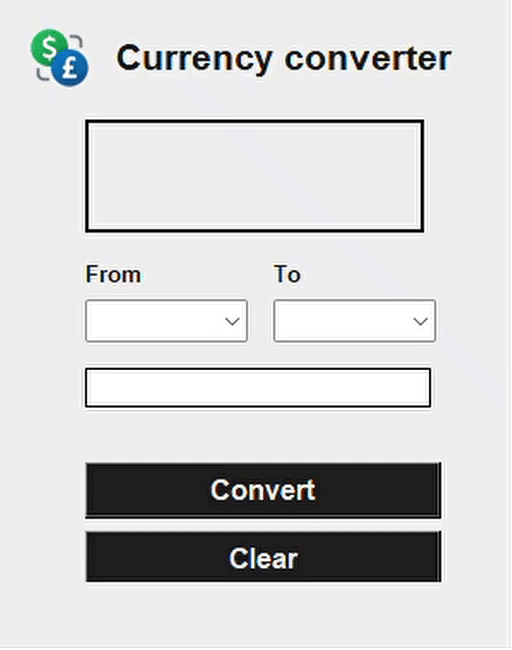

<h1 align="center">
   
  
   
  Currency converter
   
</h1>

[README em Português](README_PT.md)

## Description
Short version: this currency converter only has 2 languages (English and Portuguese).

Extended version: the python script will read the system language and connect to the internet and download data for the selected coins.

> Multi-language: EN and PT

## Resources
API used => https://rapidapi.com/solutionsbynotnull/api/currency-converter18/

## license

[MIT](LICENSE)